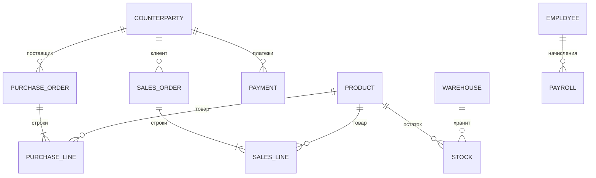

---
tags:
  - проектирование
  - бд
---
# Проектирование базы данных

Основные сущности системы, часть [[Архитектура системы]].

```mermaid
erDiagram
    COUNTERPARTY ||--o{ PURCHASE_ORDER : "поставщик"
    COUNTERPARTY ||--o{ SALES_ORDER : "клиент"
    COUNTERPARTY ||--o{ PAYMENT : "платежи"
    PURCHASE_ORDER ||--|{ PURCHASE_LINE : "строки"
    SALES_ORDER ||--|{ SALES_LINE : "строки"
    PRODUCT ||--o{ PURCHASE_LINE : "товар"
    PRODUCT ||--o{ SALES_LINE : "товар"
    PRODUCT ||--o{ STOCK : "остаток"
    WAREHOUSE ||--o{ STOCK : "хранит"
    EMPLOYEE ||--o{ PAYROLL : "начисления"
```
